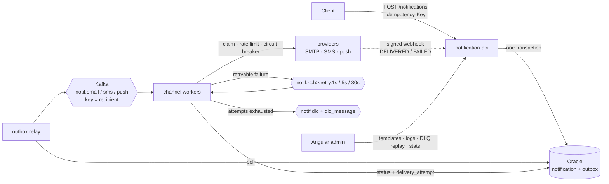

# Multi-Channel Notification Service

A notification platform written in Go. A REST API accepts a request, renders it from a versioned template and queues it on Kafka. Channel workers then deliver it by **email, SMS or push**. Failures are retried with backoff and exhausted messages go to a dead-letter queue. Each provider has a circuit breaker, each channel has a rate limit, and every attempt is tracked in Oracle. An Angular console manages templates, delivery logs and DLQ replay.

**Stack:** Go 1.26+ · Kafka (KRaft) · Oracle Database 23ai Free · Angular 22 · Prometheus + Grafana · Testcontainers · Cucumber (godog) · k6 · Docker Compose

---

## Architecture



| Component | Path | Role |
|---|---|---|
| `cmd/api` | `internal/api`, `internal/outbox` | REST API, admin endpoints, webhooks, DB migrations, outbox relay |
| `cmd/worker` | `internal/worker`, `internal/provider`, `internal/resilience` | Kafka consumers, delivery, retries, DLQ, circuit breakers, rate limits |
| `cmd/stubs` | `internal/stubs` | Fake SMS/push gateway with latency and failure injection plus signed delivery receipts |
| `admin-ui/` | | Angular operator console |
| `test/e2e/` | | Cucumber features run on Testcontainers or on the Compose stack |
| `load-tests/` | | k6 script |

### Status lifecycle

```
QUEUED → SENDING → SENT → DELIVERED
            │  ↑      └──→ FAILED             (provider receipt says it bounced)
            ↓  │
         RETRYING ──→ DEAD_LETTERED           (retries exhausted)
SENDING → FAILED                              (non-retryable: 4xx, invalid number)
DEAD_LETTERED / FAILED → QUEUED               (replay from the admin console)
```

---

## Reliability design

**Transactional outbox (no dual-write gap).** The API never writes to Kafka directly. It inserts the `notification` row and an `outbox` row in **one Oracle transaction**, and a relay publishes outbox rows to Kafka afterwards. A crash at any point either loses the whole request (the client gets a 5xx and retries) or leaves an outbox row that the relay publishes later. The relay is at-least-once, and consumers are idempotent.

**Idempotency, at both ends.**
- *API:* the `Idempotency-Key` header becomes the `message_id`, which has a `UNIQUE` constraint. A repeated key returns the original notification with `200` and `Idempotent-Replayed: true`. A repeated key with a *different* body returns `422`, detected by a SHA-256 hash of the request. Concurrent duplicates race on the unique constraint and the loser returns the winner's record.
- *Consumer:* before sending, a worker **claims** the notification with a conditional `UPDATE ... WHERE attempts < :n AND status IN (...)`. A Kafka redelivery after a rebalance finds the row already `SENT` and is skipped, so the provider is not called twice. The `messageId` is also passed to the provider as its idempotency key, which covers the one remaining window: a crash after the provider accepted but before the row was updated.

**Retry topics instead of blocking retries.** Each channel has three retry topics with fixed delays (`retry.1s`, `retry.5s`, `retry.30s`), and the attempt number travels in a header. Because each topic has a single delay, its messages are always in due-time order, so a consumer waiting on the head message never holds back one that is already due. A slow-failing message never blocks healthy traffic on the main topic.

**Error classification.** `5xx`, `408`, `429`, timeouts, connection errors and SMTP `4xx` are retryable. Other `4xx`, SMTP `5xx` and invalid recipients fail immediately with `FAILED` and are not retried.

**Dead-letter queue.** After the fourth attempt the message goes to `notif.dlq`, a feed for alerting and audit, and to the `dlq_message` table, which is the source of truth. Replay resets the attempt budget and writes a fresh outbox row in one transaction.

**Circuit breaker per provider** (`sony/gobreaker`). It opens after 5 consecutive failures, or when at least 50% of 10+ requests in a 30-second window fail, and stays open for 15 seconds. While open, sends fail fast as `CIRCUIT_OPEN` and go to the retry topics instead of hammering a dead provider. Non-retryable errors are *excluded* from the breaker's counts, because a wrong phone number says nothing about provider health.

**Rate limiting per channel** (`x/time/rate` token bucket). Limits live in `rate_limit_config`, are editable in the admin console, and workers reload them every 15 seconds without restarting.

**Ordering.** The partition key is the recipient, so one user's messages stay in order. Each partition is processed sequentially and committed only after it is handled. Parallelism comes from partitions (6 by default) times readers per worker.

**Crash-safety ordering inside the worker.** On a retryable failure the worker publishes the retry message *before* marking the row `RETRYING`. The reverse order could strand a notification with nothing left in Kafka to pick it up. The claim rules are written to accept that retry even when the row is still `SENDING`. `TestCrashBetweenRetryPublishAndStatusUpdate` covers this case.

---

## Running it

Requires Docker Desktop. Oracle needs about 2 GB of RAM, and its first start takes a minute or two.

```bash
docker compose up --build -d
```

| URL | |
|---|---|
| http://localhost:8080 | API |
| http://localhost:4200 | Admin console |
| http://localhost:8025 | Mailpit (captured emails) |
| http://localhost:8090 | Provider stubs (`/control/sms`, `/messages/sms`) |
| http://localhost:3000 | Grafana dashboard "Multi-Channel Notifications" |
| http://localhost:9090 | Prometheus |

### Send something

```bash
curl -i -X POST localhost:8080/api/v1/notifications \
  -H 'Content-Type: application/json' -H 'Idempotency-Key: order-1001-otp' \
  -d '{"templateCode":"otp-sms","recipient":"+15551234567","data":{"code":"482913","minutes":10}}'

curl -X POST localhost:8080/api/v1/notifications \
  -H 'Content-Type: application/json' \
  -d '{"templateCode":"welcome-email","recipient":"ada@example.com","data":{"name":"Ada","email":"ada@example.com"}}'
# → open http://localhost:8025

curl localhost:8080/api/v1/notifications/<id>     # status + every delivery attempt
```

### Break the SMS provider and watch the DLQ

```bash
curl -X PUT localhost:8090/control/sms -d '{"failNext": 4}'
# send an SMS, then watch it walk 1s → 5s → 30s → DEAD_LETTERED in the admin console
curl -X PUT localhost:8090/control/sms -d '{"down": true}'     # full outage: the circuit breaker opens
curl -X PUT localhost:8090/control/sms -d '{}'                 # recover
```

### API

| Method | Path | |
|---|---|---|
| POST | `/api/v1/notifications` | Send one. `Idempotency-Key` header. Returns `202` new, `200` replayed, `422` key reused with a different body |
| POST | `/api/v1/notifications/bulk` | Up to 1000 items, each with its own `idempotencyKey`; per-item results |
| GET | `/api/v1/notifications/{id}` | Status plus delivery attempts |
| POST | `/api/v1/webhooks/{provider}` | Delivery receipts, HMAC-SHA256 signed (`X-Signature: sha256=…`) |
| GET/POST | `/api/v1/admin/templates` | List active templates / create |
| GET/PUT | `/api/v1/admin/templates/{code}` | Version history / save a new version |
| POST | `/api/v1/admin/templates/{code}/versions/{v}/activate` | Roll back or forward |
| POST | `/api/v1/admin/templates/preview` | Render an unsaved template |
| GET | `/api/v1/admin/notifications` | Delivery logs (`channel`, `status`, `recipient`, `from`, `to`, `limit`, `offset`) |
| GET | `/api/v1/admin/dlq` | Dead-lettered messages |
| POST | `/api/v1/admin/dlq/{id}/replay`, `/api/v1/admin/dlq/replay` | Replay one, or many (`{"ids": [...]}`) |
| GET | `/api/v1/admin/stats?window=1h` | Per-channel counts, p95/avg latency, DLQ backlog |
| GET/PUT | `/api/v1/admin/rate-limits[/{channel}]` | Token-bucket config |
| GET | `/healthz`, `/readyz`, `/metrics` | Liveness, readiness (DB ping), Prometheus |

---

## Testing

| Layer | Command | Needs Docker |
|---|---|---|
| Unit: template rendering, error classification, retry→DLQ routing, idempotent claim, crash ordering, circuit breaker, status transitions, stub behavior | `go test ./...` | no |
| Cucumber features on Testcontainers (Oracle Free + Kafka) with the API, worker and stubs in-process | `go test -tags e2e ./test/e2e/` | yes |
| The same features against the Compose stack | `E2E_API_URL=http://localhost:8080 E2E_STUBS_URL=http://localhost:8090 go test -tags e2e ./test/e2e/` | yes |
| Load | `k6 run load-tests/send.js` | yes |

The features live in [`test/e2e/features`](test/e2e/features), for example:

```gherkin
Scenario: Given the SMS provider keeps failing, the notification lands in the DLQ
  Given the "sms" provider fails the next 4 requests
  When I send an "otp-sms" notification to "+15550200001" with data: ...
  Then within 90 seconds the notification status is "DEAD_LETTERED"
  And the notification has 4 delivery attempts
  And the DLQ contains the notification

Scenario: Given the same Idempotency-Key, only one message is sent
  ...
  And the "sms" provider accepted exactly 1 message for the notification
```

The failure-injection scenarios deliberately trip the SMS provider many times in a row. When running them against Compose, start the worker with a relaxed breaker so they don't interfere with each other: `BREAKER_MIN_REQUESTS=1000 BREAKER_CONSECUTIVE_FAILURES=1000 docker compose up -d worker`. The breaker itself is covered by `TestCircuitBreakerStopsCallingDeadProvider`.

## Observability

- **Metrics** (`/metrics` on the API at :8080 and the worker at :9091): `notifications_sent_total{channel,status}`, `notification_attempts_total{channel,outcome}`, `notification_retries_total{channel,tier}`, `provider_send_duration_seconds`, `notification_end_to_end_seconds`, `kafka_consumer_lag{topic}`, `circuit_breaker_state{provider}`, `outbox_pending`, `notification_duplicates_skipped_total`, and per-route `http_request_duration_seconds`.
- **Grafana** ships a provisioned dashboard ([`ops/grafana/dashboards`](ops/grafana/dashboards)).
- **Structured JSON logs** (`log/slog`). Every log line about a notification carries `message_id`, the Idempotency-Key, so one request can be followed from the API through each worker attempt.

## Load test results

Run `k6 run -e RATE=500 -e DURATION=5m load-tests/send.js` against the Compose stack and record the numbers here.

| Metric | Result |
|---|---|
| Sustained throughput (accepted, msgs/min) | _TBD_ |
| API p95 latency (`POST /notifications`) | _TBD_ |
| End-to-end p95 (accepted → provider hand-off) | _TBD_ (Grafana panel) |
| Error rate | _TBD_ |

Hardware: _TBD_

## Design decisions and trade-offs

- **Kafka rather than a DB queue:** throughput, replay from offsets, and an independent consumer group per channel and retry tier. A slow SMS provider cannot back up email.
- **At-least-once delivery plus idempotent consumers ≈ effectively-once.** Exactly-once across Kafka *and* an external HTTP provider is not achievable. The claim-before-send rule and provider-side idempotency keys narrow the duplicate window to a crash in the middle of a send, and even then the provider deduplicates.
- **Rendering at the API, not the worker.** Template errors surface as a synchronous `422`. Retries send exactly the same content even if the template changes later, and each notification records the template version used.
- **Single outbox relay.** Ordering by `seq` with one relay preserves per-recipient order. Scaling out would need partitioned relays or leader election. Debezium CDC on the outbox table is the usual next step.
- **Ordering versus parallelism.** Keying by recipient gives per-user ordering. Throughput scales with partition count, not with the number of recipients in flight.
- **Pure-Go Oracle driver** (`sijms/go-ora`): no Instant Client, static binaries, distroless images.

## Project layout

```
cmd/                 api, worker, stubs entrypoints
internal/
  api/               HTTP handlers (chi)
  app/               process wiring shared by cmd/ and the e2e suite
  db/                Oracle connection + embedded migrations
  domain/            types and the status state machine
  messaging/         topics, envelope, kafka-go adapter
  outbox/            outbox relay
  provider/          SMTP + HTTP providers, error classification
  render/            Mustache rendering
  resilience/        circuit breaker, rate limiters
  store/             Oracle repositories
  stubs/             fake SMS/push gateway
  worker/            consumer loop + processor (retry/DLQ logic)
admin-ui/            Angular console
test/e2e/            godog features + Testcontainers harness
load-tests/          k6
ops/                 Prometheus + Grafana provisioning
```
